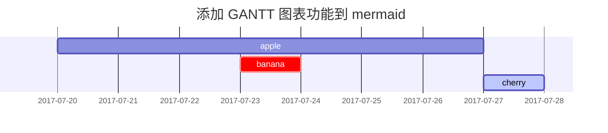

本篇文章主要展示 Markdown 语法在 [**Chirpy**]（https://github.com/cotes2020/jekyll-theme-chirpy/fork ）上的呈现，你也可以将其作为写作范例。现在，让我们开始看看文本和排版。

## Headings

# H1 - heading
{: .mt-4 .mb-0 }

## H2 - heading
{: data-toc-skip='' .mt-4 .mb-0 }

### H3 - heading
{: data-toc-skip='' .mt-4 .mb-0 }

#### H4 - heading
{: data-toc-skip='' .mt-4 }

## 段落

任何时候的进步都能提升自己，挑战自己的极限。使用机遇是成功的关键。保持乐观，面对任何困难都要坚持不懈。善待他人，才能赢得他人的尊重和支持。应对变化，适应新环境，才能在竞争中立于不败之地。坚持努力，尽管有时会有挫折，但最终会取得成功。热爱生活，珍惜每一个美好的瞬间。相信自己，无论遇到什么困难，都要继续前进。保持谦逊，虚心学习，才能不断进步。每一个微小的努力，都会为未来打下坚实的基础。

### 列表
### 排序列表
 
1. 首先
2. 其次
3. 第三次

### 无序列表
- 章节
  + 节
    * 段落

### 待办事项列表
- [ ] 工作
  + [x] 步骤 1
  + [x] 步骤 2
  + [ ] 步骤 3
#### 说明列表

太阳
: 围绕地球运行的恒星

月亮
: 地球的天然卫星，通过太阳的反射光可见

## Block Quote
> 这一行显示 _block quote_ 。
## 提示


> 一个显示 `提示` 类型提示的示例。
{: .prompt-tip }

> 一个显示 `信息` 类型提示的示例。
{: .prompt-info }

> 一个显示 `警告` 类型提示的示例。
{: .prompt-warning }

> 一个显示 `危险` 类型提示的示例。
{: .prompt-danger }

## 表格

| 公司                          | 联系人           | 国家   |
|:-----------------------------|:-----------------|--------:|
| Alfreds Futterkiste          | Maria Anders     | 德国   |
| Island Trading               | Helen Bennett    | 英国   |
| Magazzini Alimentari Riuniti | Giovanni Rovelli | 意大利 |

## 链接

<http://127.0.0.1:4000>

## 脚注

点击将定位到脚注[^footnote]，这里是另一个脚注[^fn-nth-2]。

## 行内代码

这是一个 `行内代码` 的例子。

## 文件路径

这里是 `/path/to/the/file.extend`{: .filepath}。

## 代码块

### 通用

```
这是一个通用代码片段，没有语法高亮和行号。
```

### 特定语言

```bash
if [ $? -ne 0 ]; then
  echo "命令未成功执行。";
  #执行必要操作 / 退出
fi;
```

### 特定文件名

```sass
@import
  "colors/light-typography",
  "colors/dark-typography";
```
{: file='_sass/jekyll-theme-chirpy.scss'}

## 数学

由 [**MathJax**](https://www.mathjax.org/) 提供支持的数学公式：

$$ \sum_{n=1}^\infty 1/n^2 = \frac{\pi^2}{6} $$

当 $a \ne 0$ 时，$ax^2 + bx + c = 0$ 有两个解，它们是

$$ x = {-b \pm \sqrt{b^2-4ac} \over 2a} $$

## Mermaid SVG



### 图片
### 默认（带标题）

### 左对齐

### 向左浮动

展示最大的平衡感。即使是在痛苦中，也要保持坚定。梅西纳的灯塔，犹如半开的窗户，穿透了黑暗。无论是在何种环境下，总能找到出路。坚持自己的信念，才能在充满挑战的世界中立足。无论遇到什么困难，都要勇敢面对。保持谦逊，虚心学习，不断进步。即使是在最艰难的时刻，也要保持乐观。相信自己，未来会更加美好。团结一致，才能克服一切困难。

### 漂向右边

展示最大的平衡感。即使是在痛苦中，也要保持坚定。梅西纳的灯塔，犹如半开的窗户，穿透了黑暗。无论是在何种环境下，总能找到出路。坚持自己的信念，才能在充满挑战的世界中立足。无论遇到什么困难，都要勇敢面对。保持谦逊，虚心学习，不断进步。即使是在最艰难的时刻，也要保持乐观。相信自己，未来会更加美好。团结一致，才能克服一切困难。

### 暗/亮模式和阴影
下图将根据主题偏好切换深色/浅色模式，注意它有阴影。

## 视频



## 反向脚注

[^footnote]: 脚注源
[^fn-nth-2]: 第二个脚注源
