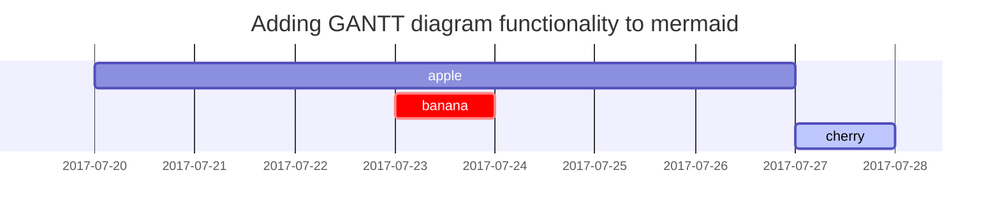

This post is to show Markdown syntax rendering on [**Chirpy**](https://github.com/cotes2020/jekyll-theme-chirpy/fork), you can also use it as an example of writing. Now, let's start looking at text and typography.

## Headings

<h1 class="mt-5">H1 - heading</h1>

<h2 data-toc-skip>H2 - heading</h2>

<h3 data-toc-skip>H3 - heading</h3>

<h4>H4 - heading</h4>

## Paragraph

Quisque egestas convallis ipsum, ut sollicitudin risus tincidunt a. Maecenas interdum malesuada egestas. Duis consectetur porta risus, sit amet vulputate urna facilisis ac. Phasellus semper dui non purus ultrices sodales. Aliquam ante lorem, ornare a feugiat ac, finibus nec mauris. Vivamus ut tristique nisi. Sed vel leo vulputate, efficitur risus non, posuere mi. Nullam tincidunt bibendum rutrum. Proin commodo ornare sapien. Vivamus interdum diam sed sapien blandit, sit amet aliquam risus mattis. Nullam arcu turpis, mollis quis laoreet at, placerat id nibh. Suspendisse venenatis eros eros.

## Lists

### Ordered list

1. Firstly
2. Secondly
3. Thirdly

### Unordered list

- Chapter
  + Section
    * Paragraph

### ToDo list

- [ ] Job
  + [x] Step 1
  + [x] Step 2
  + [ ] Step 3

### Description list

Sun
: the star around which the earth orbits

Moon
: the natural satellite of the earth, visible by reflected light from the sun

## Block Quote

> This line shows the _block quote_.

## Prompts - 提示泡泡

```markdown
> An example showing the `tip` type prompt.
{: .prompt-tip }

{: .prompt-info }

{: .prompt-warning }

{: .prompt-danger }
```
> An example showing the `tip` type prompt.
{: .prompt-tip }

> An example showing the `info` type prompt.
{: .prompt-info }

> An example showing the `warning` type prompt.
{: .prompt-warning }

> An example showing the `danger` type prompt.
{: .prompt-danger }

## Tables

| Company                      | Contact          | Country |
|:-----------------------------|:-----------------|--------:|
| Alfreds Futterkiste          | Maria Anders     | Germany |
| Island Trading               | Helen Bennett    | UK      |
| Magazzini Alimentari Riuniti | Giovanni Rovelli | Italy   |

## Links

<http://127.0.0.1:4000>

## Footnote

```markdown
Click the hook will locate the footnote[^footnote], and here is another footnote[^fn-nth-2].
```

Click the hook will locate the footnote[^footnote], and here is another footnote[^fn-nth-2].

## Inline code

This is an example of `Inline Code`.

### 单行代码着色

```
`let val_rust = 123;`{:.language-rust}
```

`let val_rust = 123;`{:.language-rust}

```
`local val_lua = 123`{:.language-lua}
```

`local val_lua = 123`{:.language-lua}


## Filepath - 文件路径提示

```
`/path/to/the/file.extend`{: .filepath}.
```

Here is the `/path/to/the/file.extend`{: .filepath}.

## Code blocks

### Common

```
This is a common code snippet, without syntax highlight and line number.
```

### Specific Language

```bash
if [ $? -ne 0 ]; then
  echo "The command was not successful.";
  #do the needful / exit
fi;
```

### Specific filename

```sass
@import
  "colors/light-typography",
  "colors/dark-typography";
```
{: file='_sass/jekyll-theme-chirpy.scss'}

## Mathematics - 数学符号

> 在文章开头需添加  `math: true`

The mathematics powered by [**MathJax**](https://www.mathjax.org/):

```mathematica
$$ \sum_{n=1}^\infty 1/n^2 = \frac{\pi^2}{6} $$
```

$$ \sum_{n=1}^\infty 1/n^2 = \frac{\pi^2}{6} $$


When $a \ne 0$, there are two solutions to $ax^2 + bx + c = 0$ and they are

> - `$a \ne 0$`
> - `$ax^2 + bx + c = 0$`

```mathematica
$$ x = {-b \pm \sqrt{b^2-4ac} \over 2a} $$
```

$$ x = {-b \pm \sqrt{b^2-4ac} \over 2a} $$


## Mermaid SVG

```Mermaid 
 gantt
  title  Adding GANTT diagram functionality to mermaid
  apple :a, 2017-07-20, 1w
  banana :crit, b, 2017-07-23, 1d
  cherry :active, c, after b a, 1d
```



## Images

### Default (with caption)

{: width="972" height="589" }
_Full screen width and center alignment_

### Left aligned

{: width="972" height="589" .w-75 .normal}

### Float to left

{: width="972" height="589" .w-50 .left}
Praesent maximus aliquam sapien. Sed vel neque in dolor pulvinar auctor. Maecenas pharetra, sem sit amet interdum posuere, tellus lacus eleifend magna, ac lobortis felis ipsum id sapien. Proin ornare rutrum metus, ac convallis diam volutpat sit amet. Phasellus volutpat, elit sit amet tincidunt mollis, felis mi scelerisque mauris, ut facilisis leo magna accumsan sapien. In rutrum vehicula nisl eget tempor. Nullam maximus ullamcorper libero non maximus. Integer ultricies velit id convallis varius. Praesent eu nisl eu urna finibus ultrices id nec ex. Mauris ac mattis quam. Fusce aliquam est nec sapien bibendum, vitae malesuada ligula condimentum.

### Float to right

{: width="972" height="589" .w-50 .right}
Praesent maximus aliquam sapien. Sed vel neque in dolor pulvinar auctor. Maecenas pharetra, sem sit amet interdum posuere, tellus lacus eleifend magna, ac lobortis felis ipsum id sapien. Proin ornare rutrum metus, ac convallis diam volutpat sit amet. Phasellus volutpat, elit sit amet tincidunt mollis, felis mi scelerisque mauris, ut facilisis leo magna accumsan sapien. In rutrum vehicula nisl eget tempor. Nullam maximus ullamcorper libero non maximus. Integer ultricies velit id convallis varius. Praesent eu nisl eu urna finibus ultrices id nec ex. Mauris ac mattis quam. Fusce aliquam est nec sapien bibendum, vitae malesuada ligula condimentum.

### Dark/Light mode & Shadow

The image below will toggle dark/light mode based on theme preference, notice it has shadows.

{: .light .w-75 .shadow .rounded-10 w='1212' h='668' }
{: .dark .w-75 .shadow .rounded-10 w='1212' h='668' }

## Video




## 运行代码显示结果

````
```rust
fn main() {
    println!("hello world");
}
```
{: run="rust" }
````


```rust
fn main() {
    println!("hello world");
}
```
{: run="rust" }


语言支持情况：

| 已支持的语言 | `run="lang"` 参数  | 后端                                            |
| ------------ | ------------------ | ----------------------------------------------- |
| C++          | `run="cpp"`        | [Coliru](https://coliru.stacked-crooked.com/)   |
| JavaScript   | `run="javascript"` | N/A (本地)                                      |
| Python       | `run="python"`     | [Online Python](https://www.online-python.com/) |
| Rust         | `run="rust"`       | [Rust Playground](https://play.rust-lang.org/)  |


## 代码块高亮

````
```c
int main(int argc, char* argv[]) {
   return 0;
}
```
{: highlight-lines="2" }
````

```c
int main(int argc, char* argv[]) {
   return 0;
}
```
{: highlight-lines="2" }


````
```plaintext
由于 Rouge 的特性，不会对纯文本代码段进行分割，
因此虽然该代码段有很多行，但是 Rouge 会使用一整个 #text 来包装他们。
这也是为什么我们需要先将元素以 `\n` 分割为多个元素，
否则像这样的纯文本，很难对其进行行高亮。
```
{: highlight-lines="2" }
````

```plaintext
由于 Rouge 的特性，不会对纯文本代码段进行分割，
因此虽然该代码段有很多行，但是 Rouge 会使用一整个 #text 来包装他们。
这也是为什么我们需要先将元素以 `\n` 分割为多个元素，
否则像这样的纯文本，很难对其进行行高亮。
```
{: highlight-lines="2" }


## Reverse Footnote

```
[^footnote]: The footnote source
[^fn-nth-2]: The 2nd footnote source
```

[^footnote]: The footnote source
[^fn-nth-2]: The 2nd footnote source


## 点击后显示


<details open=""
    style="box-sizing: inherit; display: block; transition: all 0.5s ease-out 0s; cursor: auto; width: 690px;">
    <summary
        style="box-sizing: inherit; display: flex; transition: all 0.5s ease-out 0s; cursor: pointer; list-style: none; border-radius: 8px 8px 0px 0px; background-color: rgba(255, 136, 71, 0.2);">
        <span class="accordion-trigger"
            style="box-sizing: inherit; display: inline-flex; justify-content: space-between; align-items: center; min-height: 56px; width: 642px; padding: 8px 24px;"><span
                class="trigger-text"
                style="box-sizing: inherit; font-size: 1.125rem; padding-right: 24px;">Answer</span><span
                class="btn-normalw bg-white bc-black-night fc-black-night"
                style="box-sizing: inherit; appearance: none; display: inline-flex; align-items: center; justify-content: center; height: 48px; padding: 0px 24px; font-size: 1rem; border-radius: 12px; text-decoration: none; color: rgb(20, 22, 30); border: 1px solid rgb(20, 22, 30); background-color: rgb(255, 255, 255);">Reveal</span></span>
    </summary>
    <div class="spoiler-content" style="box-sizing: inherit; padding: 16px 24px;">
        <p
            style="box-sizing: inherit; margin: 20px 0px 0px; font-size: 1rem; font-family: -apple-system, BlinkMacSystemFont, &quot;Segoe UI&quot;, Roboto, Helvetica, Arial, sans-serif, &quot;Apple Color Emoji&quot;, &quot;Segoe UI Emoji&quot;, &quot;Segoe UI Symbol&quot;; line-height: 1.66; word-break: break-word;">
        </p>
        <ul>
            <li>
                第一行
            </li>
            <li>
                第二行
            </li>
            <li>
                第三行
            </li>
            <li>
                第四行
            </li>
        </ul>
    </div>
</details>


