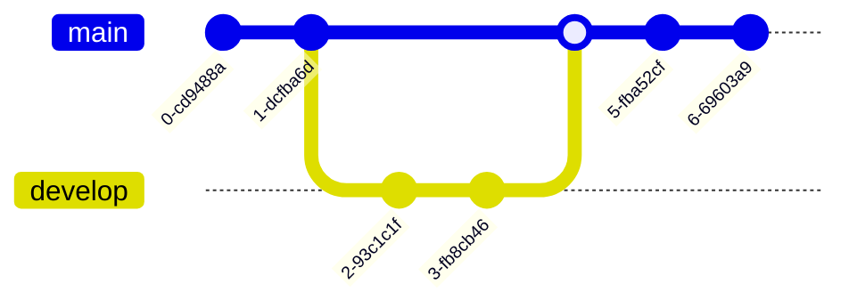

This post is to show Markdown syntax rendering on [**Chirpy**](https://github.com/cotes2020/jekyll-theme-chirpy/fork), you can also use it as an example of writing. Now, let's start looking at text and typography.

## Headings

# H1 - heading
{: .mt-4 .mb-0 }

## H2 - heading
{: data-toc-skip='' .mt-4 .mb-0 }

### H3 - heading
{: data-toc-skip='' .mt-4 .mb-0 }

#### H4 - heading
{: data-toc-skip='' .mt-4 }

## Paragraph

Quisque egestas convallis ipsum, ut sollicitudin risus tincidunt a. Maecenas interdum malesuada egestas. Duis consectetur porta risus, sit amet vulputate urna facilisis ac. Phasellus semper dui non purus ultrices sodales. Aliquam ante lorem, ornare a feugiat ac, finibus nec mauris. Vivamus ut tristique nisi. Sed vel leo vulputate, efficitur risus non, posuere mi. Nullam tincidunt bibendum rutrum. Proin commodo ornare sapien. Vivamus interdum diam sed sapien blandit, sit amet aliquam risus mattis. Nullam arcu turpis, mollis quis laoreet at, placerat id nibh. Suspendisse venenatis eros eros.

## Lists

### Ordered list

1. Firstly
2. Secondly
3. Thirdly

### Unordered list

- Chapter
  + Section
    * Paragraph

### ToDo list

- [ ] Job
  + [x] Step 1
  + [x] Step 2
  + [ ] Step 3

### Description list

```markdown
Sun
: the star around which the earth orbits

Moon
: the natural satellite of the earth, visible by reflected light from the sun
```

Sun
: the star around which the earth orbits

Moon
: the natural satellite of the earth, visible by reflected light from the sun

## Block Quote

> This line shows the _block quote_.

## Prompts - 提示泡泡

```markdown
> An example showing the `tip` type prompt.
{: .prompt-tip }

{: .prompt-info }

{: .prompt-warning }

{: .prompt-danger }
```
> An example showing the `tip` type prompt.
{: .prompt-tip }

> An example showing the `info` type prompt.
{: .prompt-info }

> An example showing the `warning` type prompt.
{: .prompt-warning }

> An example showing the `danger` type prompt.
{: .prompt-danger }

## Tables

| Company                      | Contact          | Country |
|:-----------------------------|:-----------------|--------:|
| Alfreds Futterkiste          | Maria Anders     | Germany |
| Island Trading               | Helen Bennett    | UK      |
| Magazzini Alimentari Riuniti | Giovanni Rovelli | Italy   |

## Links

<http://127.0.0.1:4000>

## Footnote

```markdown
Click the hook will locate the footnote[^footnote], and here is another footnote[^fn-nth-2].
```

Click the hook will locate the footnote[^footnote], and here is another footnote[^fn-nth-2].

## Inline code

This is an example of `Inline Code`.

### 单行代码着色

```
`let val_rust = 123;`{:.language-rust}
```

`let val_rust = 123;`{:.language-rust}

```
`local val_lua = 123`{:.language-lua}
```

`local val_lua = 123`{:.language-lua}


## Filepath - 文件路径提示

```
`/path/to/the/file.extend`{: .filepath}.
```

Here is the `/path/to/the/file.extend`{: .filepath}.

## Code blocks

### Common

```
This is a common code snippet, without syntax highlight and line number.
```

### Specific Language

```bash
if [ $? -ne 0 ]; then
  echo "The command was not successful.";
  #do the needful / exit
fi;
```

### Specific filename

```sass
@import
  "colors/light-typography",
  "colors/dark-typography";
```
{: file='_sass/jekyll-theme-chirpy.scss'}

## Mathematics - 数学符号

> 在文章开头需添加  `math: true`
>
> Ref \>> [url](https://blog.csdn.net/ajacker/article/details/80301378)

The mathematics powered by [**MathJax**](https://www.mathjax.org/):

```mathematica
$$ \sum_{n=1}^\infty 1/n^2 = \frac{\pi^2}{6} $$
```

$$ \sum_{n=1}^\infty 1/n^2 = \frac{\pi^2}{6} $$


When $a \ne 0$, there are two solutions to $ax^2 + bx + c = 0$ and they are

> - `$ a \ne 0 $`
> - `$ ax^2 + bx + c = 0 $`

```mathematica
$$ x = {-b \pm \sqrt{b^2-4ac} \over 2a} $$
```

$$ x = {-b \pm \sqrt{b^2-4ac} \over 2a} $$


### 希腊字母

- 如果要大写希腊字母，则首字母大写即可，如`\Gamma`显示为 $ \Gamma $
- 如果要使希腊字母显示为斜体，则前面添加`var`即可，如`\varGamma`显示为 $ \varGamma $

| 显示 | 命令 | 显示 | 命令 |
| ---- | ---- | ---- | ---- |
| $$ \alpha $$ | `\alpha` | $$ \beta $$ | `\beta` |
| $$ \gamma $$ | `\gamma` | $$ \delta $$ | `\delta` |
| $$ \epsilon $$ | `\epsilon` | $$ \zeta $$ | `\zeta` |
| $$ \eta $$ | `\eta` | $$ \theta $$ | `\theta` |
| $$ \iota $$ | `\iota` | $$ \kappa $$ | `\kappa` |
| $$ \lambda $$ | `\lambda` | $$ \mu $$ | `\mu` |
| $$ \nu $$ | `\nu` | $$ \xi $$ | `\xi` |
| $$ \pi $$ | `\pi` | $$ \rho $$ | `\rho` |
| $$ \sigma $$ | `\sigma` | $$ \tau $$ | `\tau` |
| $$ \upsilon $$ | `\upsilon` | $$ \phi $$ | `\phi` |
| $$ \chi $$ | `\chi` | $$ \psi $$ | `\psi` |
| $$ \omega $$ | `\omega`   |              |          |

### 矢量

单字母向量:

- `\vec a` =  $ \vec a $
- `\overrightarrow a` = $ \overrightarrow a $

多字母向量:

- `\vec {ab}` =  $ \vec {ab} $
- `\overrightarrow {ab}` = $ \overrightarrow {ab} $


## Mermaid SVG - 绘图

```
mermaid: true
```

### sequenceDiagram - 序列图

```markdown
sequenceDiagram
    Alice->>+John: Hello John, how are you?
    Alice->>+John: John, can you hear me?
    John-->>-Alice: Hi Alice, I can hear you!
    John-->>-Alice: I feel great!
```


### flowchart - 流程图

```markdown
flowchart TD
    A[Christmas] -->|Get money| B(Go shopping)
    B --> C{Let me think}
    C -->|One| D[Laptop]
    C -->|Two| E[iPhone]
    C -->|Three| F[fa:fa-car Car]
```


### classDiagram - 类图

```markdown
classDiagram
    Animal <|-- Duck
    Animal <|-- Fish
    Animal <|-- Zebra
    Animal : +int age
    Animal : +String gender
    Animal: +isMammal()
    Animal: +mate()
    class Duck{
      +String beakColor
      +swim()
      +quack()
    }
    class Fish{
      -int sizeInFeet
      -canEat()
    }
    class Zebra{
      +bool is_wild
      +run()
    }
```


### stateDiagram - 状态图

```markdown
stateDiagram-v2
    [*] --> Still
    Still --> [*]
    Still --> Moving
    Moving --> Still
    Moving --> Crash
    Crash --> [*]
```


### erDiagram - 关系图

```markdown
erDiagram
    CUSTOMER }|..|{ DELIVERY-ADDRESS : has
    CUSTOMER ||--o{ ORDER : places
    CUSTOMER ||--o{ INVOICE : "liable for"
    DELIVERY-ADDRESS ||--o{ ORDER : receives
    INVOICE ||--|{ ORDER : covers
    ORDER ||--|{ ORDER-ITEM : includes
    PRODUCT-CATEGORY ||--|{ PRODUCT : contains
    PRODUCT ||--o{ ORDER-ITEM : "ordered in"
```


### gantt - 甘特图

```Mermaid 
 gantt
  title  Adding GANTT diagram functionality to mermaid
  apple :a, 2017-07-20, 1w
  banana :crit, b, 2017-07-23, 1d
  cherry :active, c, after b a, 1d
```


### journey - 日程

```markdown
journey
    title My working day
    section Go to work
      Make tea: 5: Me
      Go upstairs: 3: Me
      Do work: 1: Me, Cat
    section Go home
      Go downstairs: 5: Me
      Sit down: 3: Me
```


### gitGraph

```markdown
gitGraph
    commit
    commit
    branch develop
    checkout develop
    commit
    commit
    checkout main
    merge develop
    commit
    commit
```





### pie - 饼图

```markdown
pie title Pets adopted by volunteers
    "Dogs" : 386
    "Cats" : 85
    "Rats" : 15
```


### mindmap - 脑图

```markdown
mindmap
  root((mindmap))
    Origins
      Long history
      ::icon(fa fa-book)
      Popularisation
        British popular psychology author Tony Buzan
    Research
      On effectivness<br/>and features
      On Automatic creation
        Uses
            Creative techniques
            Strategic planning
            Argument mapping
    Tools
      Pen and paper
      Mermaid
```


### quadrantChart - 象限图

```markdown
quadrantChart
    title Reach and engagement of campaigns
    x-axis Low Reach --> High Reach
    y-axis Low Engagement --> High Engagement
    quadrant-1 We should expand
    quadrant-2 Need to promote
    quadrant-3 Re-evaluate
    quadrant-4 May be improved
    Campaign A: [0.3, 0.6]
    Campaign B: [0.45, 0.23]
    Campaign C: [0.57, 0.69]
    Campaign D: [0.78, 0.34]
    Campaign E: [0.40, 0.34]
    Campaign F: [0.35, 0.78]
```


## Images

### Default (with caption)

{: width="972" height="589" }
_Full screen width and center alignment_

### Left aligned

{: width="972" height="589" .w-75 .normal}

### Float to left

{: width="972" height="589" .w-50 .left}
Praesent maximus aliquam sapien. Sed vel neque in dolor pulvinar auctor. Maecenas pharetra, sem sit amet interdum posuere, tellus lacus eleifend magna, ac lobortis felis ipsum id sapien. Proin ornare rutrum metus, ac convallis diam volutpat sit amet. Phasellus volutpat, elit sit amet tincidunt mollis, felis mi scelerisque mauris, ut facilisis leo magna accumsan sapien. In rutrum vehicula nisl eget tempor. Nullam maximus ullamcorper libero non maximus. Integer ultricies velit id convallis varius. Praesent eu nisl eu urna finibus ultrices id nec ex. Mauris ac mattis quam. Fusce aliquam est nec sapien bibendum, vitae malesuada ligula condimentum.

### Float to right

{: width="972" height="589" .w-50 .right}
Praesent maximus aliquam sapien. Sed vel neque in dolor pulvinar auctor. Maecenas pharetra, sem sit amet interdum posuere, tellus lacus eleifend magna, ac lobortis felis ipsum id sapien. Proin ornare rutrum metus, ac convallis diam volutpat sit amet. Phasellus volutpat, elit sit amet tincidunt mollis, felis mi scelerisque mauris, ut facilisis leo magna accumsan sapien. In rutrum vehicula nisl eget tempor. Nullam maximus ullamcorper libero non maximus. Integer ultricies velit id convallis varius. Praesent eu nisl eu urna finibus ultrices id nec ex. Mauris ac mattis quam. Fusce aliquam est nec sapien bibendum, vitae malesuada ligula condimentum.

### Dark/Light mode & Shadow

The image below will toggle dark/light mode based on theme preference, notice it has shadows.

{: .light .w-75 .shadow .rounded-10 w='1212' h='668' }
{: .dark .w-75 .shadow .rounded-10 w='1212' h='668' }

## Video




## 运行代码显示结果

````
```rust
fn main() {
    println!("hello world");
}
```
{: run="rust" }
````


```rust
fn main() {
    println!("hello world");
}
```
{: run="rust" }


语言支持情况：

| 已支持的语言 | `run="lang"` 参数  | 后端                                            |
| ------------ | ------------------ | ----------------------------------------------- |
| C++          | `run="cpp"`        | [Coliru](https://coliru.stacked-crooked.com/)   |
| JavaScript   | `run="javascript"` | N/A (本地)                                      |
| Python       | `run="python"`     | [Online Python](https://www.online-python.com/) |
| Rust         | `run="rust"`       | [Rust Playground](https://play.rust-lang.org/)  |


## 代码块高亮

````
```c
int main(int argc, char* argv[]) {
   return 0;
}
```
{: highlight-lines="2" }
````

```c
int main(int argc, char* argv[]) {
   return 0;
}
```
{: highlight-lines="2" }


````
```plaintext
由于 Rouge 的特性，不会对纯文本代码段进行分割，
因此虽然该代码段有很多行，但是 Rouge 会使用一整个 #text 来包装他们。
这也是为什么我们需要先将元素以 `\n` 分割为多个元素，
否则像这样的纯文本，很难对其进行行高亮。
```
{: highlight-lines="2" }
````

```plaintext
由于 Rouge 的特性，不会对纯文本代码段进行分割，
因此虽然该代码段有很多行，但是 Rouge 会使用一整个 #text 来包装他们。
这也是为什么我们需要先将元素以 `\n` 分割为多个元素，
否则像这样的纯文本，很难对其进行行高亮。
```
{: highlight-lines="2" }


## Reverse Footnote

```
[^footnote]: The footnote source
[^fn-nth-2]: The 2nd footnote source
```

[^footnote]: The footnote source
[^fn-nth-2]: The 2nd footnote source


## 点击后显示


<details>
  <summary>
    <i>Click to view features</i>
  </summary>
  <ul>
	  <li> Dark / Light Theme Mode </li>
   	  <li> Dark / Light Theme Mode </li>
    </ul>
</details>


```html
<details>
  <summary>
    <i>Click to view features</i>
  </summary>
  <ul>
	  <li> Dark / Light Theme Mode </li>
   	  <li> Dark / Light Theme Mode </li>
    </ul>
</details>
```


