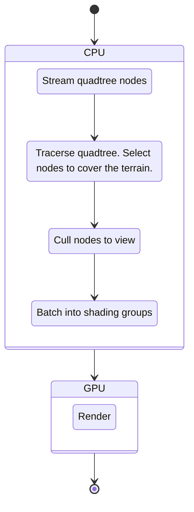
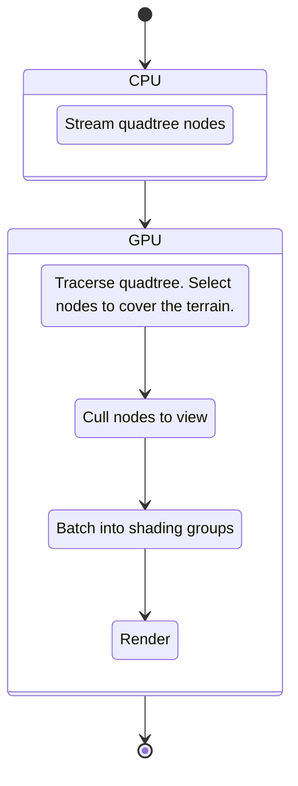

## 术语

### Sector

最高分辨率的平铺块

## 流程

### CPU 实现版本

### GPU 实现版本

- 数据仅在GPU处理
- 

### Stream quadtree nodes

#### 常见的流式加载策略

1. 加载环绕角色周围的最高级高精度 LOD
2. 下一级LOD的范围将覆盖全地图一半的距离
3. 直到所有低层次的LOD被加载完成

#### 一些细节

- 重叠区域的重复加载

- 加载是异步的

  > 

### Tracerse quadtree

- 哪些节点是真正被渲染的？
- 从四叉树根节点深度遍历，直接子节点被加载，并细分该节点

### Cull Nodes To View

- 只需要渲染在视锥内的 Node

### Batch into Shading Groups

- Shader的LOD分层，可以与Node的LOD不相关

## Terrain Quad Tree - 四叉树

Node存储的信息

- 高度图
- 世界坐标系法线图
- 地形纹理
- ...

## GPU 四叉树

## LOD

## 接缝处理

## 怎么做离线存储

